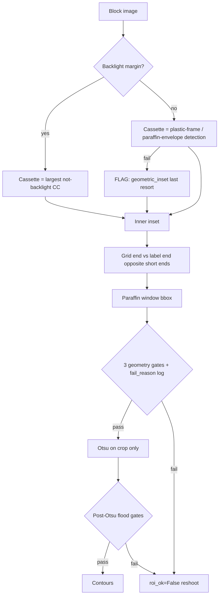

# Design: Robust block capture & paraffin ROI pipeline

**Status:** Draft v2 — pitfall resolutions incorporated (2026-05-24)  
**Owner:** Zeke  
**North star:** Functional enough to **verify** claimed block–slide pairs **most of the time** — not mask perfection on every phone library frame.  
**Context:** Fix 1b audit failures. Policy: [phase3_outputs/mentor_questions.md](../../phase3_outputs/mentor_questions.md).

**This file is a brainstorm design input.** It is **not** `proposed_plan.md`. Next steps: session-synthesizer → `proposed_plan.md` v1 → pre-mortem → plan v2 → implement.

---

## 1. Problem

Block silhouette segmentation fails when:

1. No visible backlight border — cassette fills the frame.
2. Wrong interior blob — side column or pad slit.
3. `roi_detection_ok=False` → full-frame Otsu masks plastic + pad.
4. Rotation — fixed “top/bottom %” heuristics break.

Slides: label rectangle mask only (yellow = same geometry as white).

---

## 2. Goals (scoped)

| Goal | Measure |
|------|---------|
| Paraffin-window crop when possible | Pilot **visual** audit (not matching scores) |
| Work with or without white pad border | Detection-based cassette; geometric fallback **flagged** |
| Any block orientation | Grid + label via **opposite short ends** |
| Failed auto → re-shoot signal | No silent full-frame seg in production mode |
| Downstream | Enough good masks to **iterate verification** before Phase 4 |

Non-goals: perfect 47/47 phone library; motion capture (later); HSV on **blocks**; changing frozen `segment_tissue()`.

---

## 3. Approaches

### A — Layered masks (recommended)

1. Optional backlight mask → detection-based cassette.
2. Paraffin window inside inner cassette; grid + label at **opposite short ends**.
3. Otsu on crop only; inadequate → **reshoot**, not HSV on blocks.

### B — Single morph blob (Fix 1b)

Proven insufficient on many close-frame sets.

### C — Manual ROI

Last resort; Zeke prefers auto re-shoot.

---

## 4. Architecture

---

## 5. Stage details

### 5.1 Backlight margin (optional)

- Bright pad: `gray > 240` or HSV `V>230, S<30`.
- `has_backlight_margin`: bright pixels touch ≥2 image edges AND ≥3% of edge perimeter.
- **If true:** cassette = largest connected component of `not backlight` (detection-based).

### 5.2 No-border cassette (no fixed central % as primary)

**Primary (detection-based):**

1. **Plastic frame contour:** threshold gray ~80–135 for cassette rim; largest closed contour whose area is 15–92% of image; bbox = cassette.
2. **Paraffin envelope fallback:** if (1) fails, largest connected component of paraffin-intensity mask (140–239) that spans ≥35% of image width and is not touching all four edges.

**Last resort only (flagged):**

- Symmetric geometric inset (~8% per side from image bounds) when (1) and (2) fail.
- CSV: `cassette_method` ∈ `{backlight_cc, plastic_frame, paraffin_envelope, geometric_inset}`.
- `geometric_inset` must **not** set `roi_detection_ok=True` by itself — only allows attempting paraffin step with `low_confidence=True`.

**Removed:** “central 70–85% of image” as a primary branch.

### 5.3 Inner inset + paraffin window

- Erode cassette bbox ~5–8% per side → `inner_bbox`.
- Paraffin pixels: gray ∈ [140, 239] (recalibrate on Pi).
- Morph close; score contours (area × width ratio × center penalty).

**Grid vs label (committed, rotation-aware):**

- Cassette has two **short ends**. Grid lives on one short end (same end as barcode on physical cassette).
- **Grid end:** scan **both** short ends of inner bbox for row-transition score; higher score = grid end; strip that band (~12–18% of short side).
- **Label end:** always the **opposite** short end from grid end (label and grid are opposite ends on white cassettes).
- **Label strip:** exclude ~15–22% band along label short end (dark horizontal band detector is **fallback** only if grid score on both ends is ambiguous within 10% — log `label_method=opposite_end|dark_band_fallback`).

**No “top N%” without orientation** — top/bottom only appear in debug logs after grid end is chosen.

### 5.4 ROI geometry validation (3 gates, not 5)

Pass `roi_detection_ok=True` only if **all** of:

| Gate | Rule | Fail code |
|------|------|-----------|
| G1 Wax present | Paraffin-intensity pixels ≥ 12% of ROI area | `paraffin_low` |
| G2 Not a sliver | ROI width ≥ 42% of inner cassette width | `roi_narrow` |
| G3 Not pad bleed | Backlight-bright pixels in ROI < 25% | `backlight_flood` |

**Empty wax only (lower bound, not AND upper bound):** if dark (tissue) pixels < 0.03% of ROI → fail `empty_wax` (separate from G1–G3).

**Dropped as hard AND gates:** dark ≤70% cap, tissue centroid inside ROI (optional debug only).

**Telemetry:** every failure writes `roi_fail_reason` (one code). Pilot analysis: histogram of fail codes — tune thresholds if one code dominates on **visually good** images.

**Expected pass rate:** not predicted numerically pre-Pi; on 10-set pilot, if >3 failures are `roi_narrow` or `paraffin_low` on **visually correct** frames, relax that gate — not “add more gates.”

### 5.5 Tissue segmentation (blocks: Otsu only)

- Run frozen `segment_tissue()` on paraffin crop only.
- **No HSV fallback on block silhouettes** — unstained wax/tissue has weak hue signal; HSV remains for **slides** in Phase 4.

**Post-Otsu inadequacy → reshoot** (not HSV):

| Check | Threshold | Meaning |
|-------|-----------|---------|
| Empty mask | tissue pixels < 0.03% of crop | `seg_empty` |
| Flood | mask area > **85%** of crop | Whole crop white in binary → `seg_flood` |
| Blob | mask area > **55%** of paraffin ROI **and** ≤2 filtered contours | Likely plastic, not tissue islands → `seg_blob` |

**Why three different numbers (pitfall #5):**

- **12%** — geometry: “did we find a wax window?” (pre-seg).
- **55%** — post-seg: “did Otsu paint most of the wax window as tissue?” (suspicious for block silhouettes).
- **85%** — post-seg: “did Otsu eat the entire crop?” (catastrophic flood).

No single “max tissue %” applies at both stages; pre-seg does **not** cap dark at 70%.

### 5.6 Production vs analysis mode

- **Production:** `roi_detection_ok=False` or post-Otsu fail → **no contours**, `reshoot_recommended=True`.
- **Analysis:** optional full-frame seg for debugging only (explicit flag).

---

## 6. Capture / re-shoot (later)

Motion settle → capture → if ROI/seg fail → re-shoot. Fields: `capture_quality`, `reshoot_recommended`, `roi_fail_reason`, `cassette_method`.

---

## 7. Metrics & phase gating

- **Primary:** verification pass rate (iterate gap threshold from data; 0.01 not assumed).
- **Mask work:** visual audit cohorts `roi_ok` vs `roi_failed` — do not mix in gap stats without labeling.
- **Phase 4:** blocked on **functional** block masks on Pi sample, not phone-library perfection.
- **set_01 slide:** excluded until re-shoot.

---

## 8. Pilot protocol (success criterion defined)

**Sets (10):** 02, 04, 06, 11, 28, 31, 33, 35, 40, 45 (mix of Fix 1b pass/fail clusters).

**Baseline:** Fix 1b — count how many of these 10 pass **visual** audit (cyan ROI on wax, green on tissue, no full-frame plastic flood). Record N₀ (expect ~2–4/10).

**Pass criterion for Fix 1c pilot:** **≥7/10** pass same visual rubric **and** zero new full-frame fallback on those 10.

**If 5–6/10:** tune gates using `roi_fail_reason` histogram; one more pilot iteration.

**If ≤4/10:** stop — geometry approach wrong, revise design before 47-set regen.

**Do not** judge pilot by verification score or gap — matching is untrusted until masks improve.

**Regen 47:** only after pilot ≥7/10.

---

## 9. Error handling

| Condition | Behavior |
|-----------|----------|
| ROI geometry fail | `roi_ok=False`, log `roi_fail_reason`, reshoot |
| Seg fail | empty contours, `seg_fail_reason`, reshoot |
| `cassette_method=geometric_inset` | allow paraffin attempt but cap confidence; never hide bad framing |
| Barcode image | skip ROI (unchanged) |

---

## 10. Out of scope

- Frozen Phase 1/2 signature changes.
- Block HSV fallback (remove from Fix 1c block path if still present in code).
- Full 47-set regen before pilot pass.
- Deliberate mismatches (timing TBD).

---

## 11. Workflow checklist (corrected)

- [x] Brainstorm design (this file)
- [ ] Zeke approves design v2
- [ ] Session synthesizer → **new** `.cursor/specs/proposed_plan.md` v1 (Fix 1c addendum)
- [ ] Pre-mortem critic → `pre_mortem.md`
- [ ] Plan v2 revision
- [ ] Implement + tests
- [ ] Pilot 10 with defined ≥7/10 visual gate

**Not a substitute:** this doc does not replace synthesizer / pre-mortem / plan v2.

---

## 12. Plain-language summary

Find the box by **looking** (plastic edge or wax blob), not by guessing the middle of the photo. Find which end has the grid, strip it, strip the **opposite** end for the label, then find tissue in the wax with Otsu. If that fails, ask for a **new photo** — don’t try color tricks on unstained blocks. Success means **7 of 10** test photos look right to your eye, not a perfect score on every old phone picture.
