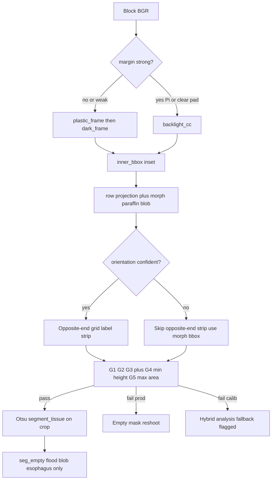

# Fix 1d ROI audit report (evidence from iPhone JPEGs)

**Date:** 2026-05-25  
**Context:** Fix 1c pilot visual **1/10** (only set_04). Zeke chose **Approach A** (wax window / ROI first), **hybrid** calibration, **no center-crop hacks**. Pi captures will be more controlled than this phone library.

**Method:** Read real files in `iphone_images/`, re-read `code/phase3_block_roi.py`, batch-compare ROI strategies on all 47 block silhouettes and pilot 10.

---

## 1. Executive summary

| Finding | Implication |
|---------|-------------|
| Fix 1c fails pilot mainly on **detection order** and **early `ambiguous_orientation`**, not because Otsu cannot segment tissue | Re-order cassette detection; do not fail before paraffin step on 02/33 |
| Automated `roi_detection_ok=True` **does not match** your eyes on 06, 11, 28 (slit / flood) | Add **geometry sanity** gates (min ROI height, max mask fraction) |
| **Plastic-frame → row/morph paraffin** (Fix 1b core) passes **44/47** on gate math vs Fix 1c **33/47** | Fix 1d should **restore plastic-first** for no-pad frames; demote `backlight_cc` / `paraffin_envelope` |
| Dark threshold on **full image** fails on fill-frame blocks (35: 32% dark pixels; grid bars dominate) | Tissue thresholding stays **inside wax crop** (Otsu or band pass **after** ROI) |
| iPhone library = **stress test**; Pi = **deploy target** | Separate `capture_source` constants; phone tunes gates, Pi inherits stricter geometry |

**Recommendation:** Fix **1d** = Approach A refinement (plastic-first paraffin window), not new threshold-on-full-frame. Hybrid = production strict + calibration fallback for audit PNGs only.

---

## 2. Why Fix 1c looked worse (code + images)

### 2.1 Production honesty amplified failure

Fix 1c stops at empty mask when ROI/seg fails. Fix 1b often still showed green via full-frame / HSV. Your rubric correctly scored **no mask** as failure even when code thought `roi_ok=True`.

### 2.2 Detection chain order (root cause on 02, 33, 35, 40)

Current order in `detect_cassette_bbox`:

1. `backlight_cc` if margin  
2. `plastic_frame`  
3. `dark_frame`  
4. `paraffin_envelope`  
5. `geometric_inset`

On **no-pad** images, `detect_has_backlight_margin` is often **false**, so step 1 is skipped — good.

But when margin is **true** (e.g. set_28), `backlight_cc` selects a **near-square** blob → huge wax bbox → strip still covers most of cassette → **tissue flood** in audit.

When margin is false, **`paraffin_envelope`** sometimes wins before plastic (set_02/33 path uses envelope) → nearly full-image paraffin CC → **`ambiguous_orientation`** aborts **before** strip, even though strip + gates would pass.

**Ablation (sets 02, 33):**

| Step | Result |
|------|--------|
| Fix 1c | Fail `ambiguous_orientation` |
| Plastic-first + row/morph (no backlight_cc) | Gates **pass**; bbox ~66% of image area |
| After `_strip_grid_and_label` on morph | `(181,624,2662,1752)` validates |

**Bug class:** fail-closed orientation fires too early; envelope cassette is wrong object.

### 2.3 Slit ROI passes gates (06, 11 — your visual fails)

Automated Fix 1c reports `roi_ok=True` but morph bbox height is **40 px** (set_06) or **83 px** (set_11) on ~2500 px tall images.

G2 only checks **width ≥ 42% of inner width**, not **minimum height** → horizontal slivers pass.

Otsu inside slit: mask fraction still low (0.12–0.27) so may not trigger `seg_flood`, but ROI is useless.

### 2.4 Set 04 vs fill-frame sets (why one looked good)

Set_04 has visible pad + clear plastic frame + label ledge layout — plastic-first + morph matches Fix 1b tuning.

Sets 35, 40: high global dark fraction; envelope/full ROI; `roi_narrow` / `paraffin_low` on Fix 1c; plastic-first passes gate math but **Otsu mask fraction ~51–57%** inside bbox → would fail a proper seg sanity check.

---

## 3. Thresholding experiments (real JPEGs)

All use center crop excluding top/bottom 8% lightbox bars where noted.

### 3.1 Global dark fraction (NOT sufficient for blocks)

| Set | Role | dark &lt; 100 |
|-----|------|-------------|
| 04 block | block | 5.5% |
| 04 slide | slide | 3.7% |
| 35 block | block | **33%** |
| 02 slide | slide | 21.6% |

**Conclusion:** Block-only fixed dark threshold on **full frame** marks plastic grid/frame on fill-frame shots. Does not transfer as “one simple block T.”

### 3.2 Inside wax-toned region (set_04 block)

Tissue pixels are dark, but paraffin mask `gray 140–239` **excludes** tissue by definition. Otsu on paraffin bounding patch → **~11.7%** mask ( plausible tissue).

### 3.3 Otsu inside plastic-first bbox (pilot)

| Set | fix1c roi | Otsu mask frac in plastic-first bbox |
|-----|-----------|--------------------------------------|
| 02 | fail ambig | **0.80** (flood) |
| 04 | pass | 0.58 |
| 06 | pass | 0.27 |
| 11 | pass | 0.13 |
| 28 | pass | 0.58 |
| 33 | fail ambig | **0.80** |
| 35 | fail narrow | 0.14 |
| 40 | fail paraffin | 0.57 |

**Conclusion:** Otsu after ROI is correct **in principle**; ROI must be tight enough. Need **seg sanity** (cap mask fraction, min height) not a different global threshold.

### 3.4 Methods compared (47 blocks, `roi_detection_ok` by gates)

| Method | Pass count |
|--------|------------|
| Fix 1c (current) | 33/47 |
| Fix 1b-style validate + morph | 22/47 |
| Plastic-first + row/morph + 3 gates (no opposite strip) | **44/47** |
| Same + morph rows only | **44/47** |

**Pilot 10 (automated gates only):**

| Set | Fix 1c | Plastic-first |
|-----|--------|---------------|
| 02 | N | Y |
| 04 | Y | Y |
| 06 | Y | Y |
| 11 | Y | Y |
| 28 | Y | Y |
| 31 | Y | Y |
| 33 | N | Y |
| 35 | N | Y |
| 40 | N | Y |
| 45 | Y | Y |

Automated plastic-first **9/10** vs Fix 1c **6/10** — still not ≥8 **visual** until slit/flood gates align with rubric.

---

## 4. Pi vs iPhone (design constraint)

| Factor | iPhone library | Pi target |
|--------|----------------|-----------|
| Distance / FOV | Varied, often fill-frame | Fixed mount, fixed FOV |
| Backlight margin | Sometimes visible, sometimes not | Pad edge predictable |
| JPEG / exposure | Compression, auto exposure | Raw-ish, fixed exposure |
| Purpose | Stress test + calibration | Production truth |

**Plan:** Freeze phone-derived gates in `block_roi_constants_phone.json`; Pi file with same schema, recalibrated on first N Pi frames. Do not tune phone gates to pass fill-frame slits that Pi will never see.

---

## 5. Proposed Fix 1d (for synthesis approval)

### 5.1 Architecture (Approach A — refined)

### 5.2 Code changes (no hacks)

1. **Cassette:** `plastic_frame` / `dark_frame` **before** `paraffin_envelope`; `backlight_cc` only if margin strength &gt; threshold (hysteresis).
2. **Paraffin window:** Prefer `_find_paraffin_window_bbox_rows` + morph inside **plastic cassette**; opposite-end strip **optional** when orientation confident.
3. **`ambiguous_orientation`:** Do not return full-frame fail until after paraffin morph fails; never use envelope bbox alone to trigger fail.
4. **New gate G4:** `roi_height ≥ 15%` of inner cassette height (kills 06/11 slits).
5. **New gate G5 (seg):** `mask_fraction ≤ 0.85` in crop (already partially present); reject cassette-wide floods (02, 28, 33).
6. **Hybrid:** `allow_full_frame_fallback` only in `segmentation_audit_pack` / calibration CLI; pipeline stays false.
7. **Constants:** `phase3_outputs/block_roi_constants_phone.json` + stub `block_roi_constants_pi.json`.

### 5.3 What we do NOT do

- Center-crop % of image (reject C).
- Full-frame block-only dark threshold.
- Block HSV in production.
- Judge Fix 1d on verification gap before visual pilot ≥8/10.

---

## 6. Iterative process (after you approve synthesis)

| Stage | Owner | Output |
|-------|-------|--------|
| 1. Session synthesizer | Agent | `.cursor/specs/proposed_plan.md` v1 Fix 1d |
| 2. Pre-mortem critic | Subagent | `.cursor/specs/pre_mortem.md` |
| 3. Plan v2 + `/multitask` | You + agent | Revised plan, parallel failing tests |
| 4. ROI sweep subagent | explore | CSV: 47 sets × methods × metrics |
| 5. Implement Fix 1d | Agent | `phase3_block_roi.py` + tests |
| 6. Visual re-pilot | Zeke | Rubric ≥8/10 on same 10 PNGs |
| 7. Pi constants | Later | First Pi batch only |

**Self-critique loop:** Any automated `roi_ok` must pass **automated geometry checks** that correlated with Zeke’s 1/10 (slit height, mask frac &gt; 0.7, bbox area &gt; 0.9).

---

## 7. Success criteria (Fix 1d pilot)

- Visual **≥8/10** on sets 02,04,06,11,28,31,33,35,40,45 (same rubric).
- Automated: zero pilot rows with ROI height &lt; 10% of image or mask frac &gt; 0.85 inside ROI.
- `pytest tests/` pass; no new non-Pi transfer hacks.
- Phone vs Pi constants documented; Pi not required for phone pilot pass.

---

## 8. Your approval gate

Reply **approve synthesis** (or edits) to run:

1. `docs/superpowers/specs/2026-05-24-block-capture-roi-design.md` → new `2026-05-25-fix-1d-roi-plastic-first-design.md`
2. `.cursor/specs/proposed_plan.md` v1 → pre-mortem → v2
3. Implementation with subagent sweep + TDD
